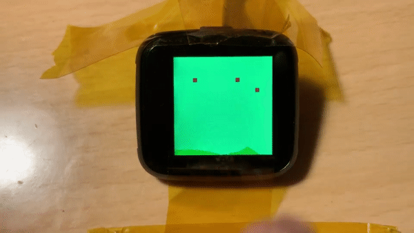

# Getting Started

> These instructions are macOS centric right now, but the Mbed toolchain will work on Mac, Windows, and Linux. Improvments to these instructions are welcome. 

Install the arm-eabi-none toolchain
```
brew tap PX4/homebrew-px4
brew install PX4/homebrew-px4/gcc-arm-none-eabi-63
```

Optionally, install `nrfjprog`
```
brew cask install nordic-nrf-command-line-tools
```

Checkout all submodules `git submodule update --init --recursive`.

Install all the Python packages required for Mbed. Your options are:
- Install from the Pipfile. `pipenv install`
- Install from Mbed requirements.txt `pip install -r modules/mbed-os/requirements.txt`

To use the Makefiles, you must set the environment variable `MBED_PINETIME_PATH` to the root of the repository. If anyone has ideas on how to not need this or otherwise improve the build system, let me know.


# Development Notes

- [x] BMA421 Accelerometer
- [-] HRS3300 Heart Rate Sensor
- [x] Hynitron CST816S Touch Pad
- [-] Sitronix ST7789V LCD Driver
- [x] Macronix SPI Flash
- [x] Vibrator
- [x] LED backlight
- [x] ADC Battery Voltage Sense
- [ ] Physical button

### I2C 
00> 0x15 Touchpad
- Only responds after a touch event.
- At 100khz, Limit of read from register 0x00 after a touch event is 190-195ish bytes. This is probably due to the chip going back to sleep.
	
00> 0x18 ACK Accelerometer
- BMA421 -- Not a public avalible chip, therefore no publicly availible drivers.
- Similar to BMA423
- Seems to require binary blob on startup (chip firmware?)
	
00> 0x44 ACK HALS3300 Heart Rate Sensor
- Datasheet is OK
- Resolution was set to 16bits 0x08
- Gain was set to 1 0x02

### SPI
Flash:
- SPI flash is now working with Mbed SPIF driver
- Needed to be "reset" by letting the battery die
- 4194304 bytes

Display:
- Display needs mode 3 SPI?
- https://www.allaboutcircuits.com/technical-articles/spi-serial-peripheral-interface/
- Got it sort-of working with Mbed ports of the Adafruit GFX libraries. 
- Still work to be done here

I can't get the physical button to work for the life of me. Someone please help 😂
